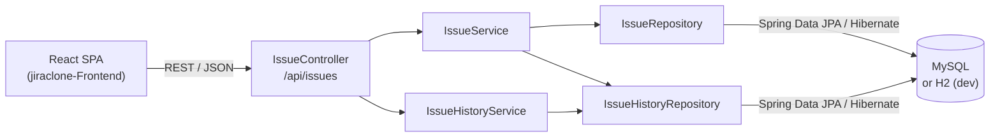
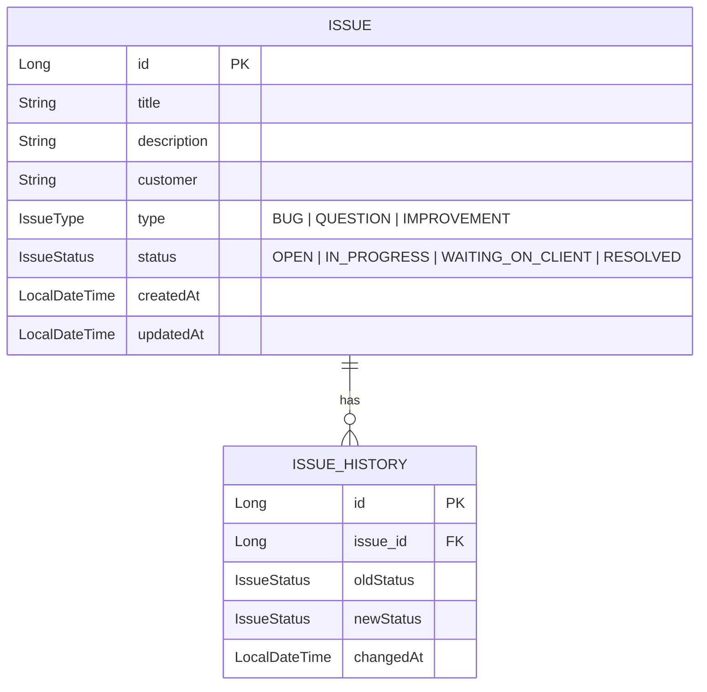
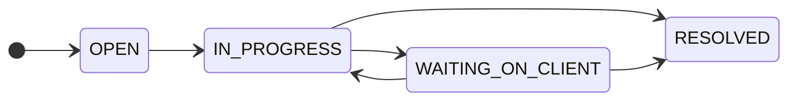

<p align="center">
  
</p>

<h1 align="center">forge. — Issue Tracker API</h1>

<p align="center">
  A lightweight, Jira-style issue tracker for logging customer issues and moving them through a support workflow.
  <br />
  <a href="https://github.com/AshanOdi/jiraclone-Frontend">Frontend</a> · <b>Backend</b> (this repo)
</p>

<p align="center">
  
  
  
  
  
</p>

---

## Overview

forge. is a full-stack project split into two repositories:

| Repo | What it is |
| --- | --- |
| **[jiraclone-Frontend](https://github.com/AshanOdi/jiraclone-Frontend)** | React single-page app: dashboard, Kanban board and issue forms |
| **[jiraclone-Backend](https://github.com/AshanOdi/jiraclone-Backend)** (this repo) | Spring Boot REST API with JPA, backed by MySQL (or H2 for local development) |

The API stores issues, each with a **type** (`BUG`, `QUESTION`, `IMPROVEMENT`) and a **status**. Every status change is saved as an `IssueHistory` record, so each issue keeps a full audit trail.

## Screenshots

| Dashboard | Issue Board |
| --- | --- |
|  |  |

| Issue Detail (history from this API) | Create Issue |
| --- | --- |
|  |  |

## Features

- REST API for issues: create, list, get, update, delete
- Dedicated **status update** endpoint that records old status, new status and time in `IssueHistory`
- New issues always start as `OPEN`; `createdAt` and `updatedAt` are set by the server
- History is returned inside each issue (`histories`), and is removed when the issue is deleted (cascade + orphan removal)
- **Two database setups**:
  - **MySQL** by default, with connection settings from environment variables
  - **H2 `dev` profile**: an embedded file database, so the API runs with **no database install**
- CORS enabled for the React frontend

## Architecture



Classic layered design: **controller → service → repository → database**.

## Tech stack

**Backend (this repo)**

| Area | Tools |
| --- | --- |
| Language / runtime | Java 24 |
| Framework | Spring Boot 3.5 (Spring Web, Spring Data JPA) |
| ORM | Hibernate |
| Database | MySQL (default), H2 (`dev` profile) |
| Boilerplate | Lombok (`@Data`) |
| Build | Maven, via the Maven Wrapper (`./mvnw`) |

**Frontend ([jiraclone-Frontend](https://github.com/AshanOdi/jiraclone-Frontend))**: React 19, Vite 7, React Router 7, Tailwind CSS 4, shadcn/ui-style components, lucide-react, Chart.js, axios.

## Data model



Tables are created and updated automatically by Hibernate (`spring.jpa.hibernate.ddl-auto=update`).

## Issue workflow



The frontend enforces this flow. The API accepts any valid `IssueStatus`.

## API reference

Base URL: `http://localhost:8080/api/issues`

| Method | Endpoint | Description | Body |
| --- | --- | --- | --- |
| `GET` | `/api/issues` | List all issues (with history) | — |
| `GET` | `/api/issues/{id}` | Get one issue | — |
| `POST` | `/api/issues` | Create an issue (status forced to `OPEN`) | `title`, `customer`, `description`, `type` |
| `PUT` | `/api/issues/{id}` | Update all editable fields | `title`, `customer`, `description`, `type`, `status` |
| `PUT` | `/api/issues/{id}/status` | Change status and **record history** | `status` |
| `DELETE` | `/api/issues/{id}` | Delete an issue and its history | — |
| `GET` | `/api/issues/cat` | Issues grouped by status (list of 4 lists, in workflow order) | — |

> Only `PUT /{id}/status` writes a history record. The full update (`PUT /{id}`) changes fields without adding history.

### Examples

```bash
# create
curl -X POST http://localhost:8080/api/issues \
  -H "Content-Type: application/json" \
  -d '{"title":"Login page returns 500","customer":"Acme","description":"Cannot log in","type":"BUG"}'

# move status
curl -X PUT http://localhost:8080/api/issues/1/status \
  -H "Content-Type: application/json" \
  -d '{"status":"IN_PROGRESS"}'
```

Response:

```json
{
  "id": 1,
  "title": "Login page returns 500",
  "description": "Cannot log in",
  "customer": "Acme",
  "type": "BUG",
  "status": "IN_PROGRESS",
  "histories": [
    { "id": 1, "oldStatus": "OPEN", "newStatus": "IN_PROGRESS", "changedAt": "2026-10-01T17:09:30.630969" }
  ],
  "createdAt": "2026-10-01T17:09:30.568771",
  "updatedAt": "2026-10-01T17:09:30.625105"
}
```

## Project structure

```
src/main/java/com/example/entgra/
├── EntgraApplication.java          # Spring Boot entry point
├── config/WebConfig.java           # CORS configuration
├── controller/IssueController.java # REST endpoints
├── entity/                         # Issue, IssueHistory, IssueStatus, IssueType
├── repository/                     # Spring Data JPA repositories
└── service/                        # IssueService, IssueHistoryService
src/main/resources/
├── application.properties          # default profile (MySQL)
└── application-dev.properties      # dev profile (H2 file database)
run-dev.sh                          # start the API with the H2 dev profile
```

## Getting started

### Prerequisites

- **JDK 24.** No admin rights? Download a JDK `.tar.gz` (for example from [Adoptium](https://adoptium.net/temurin/releases/?version=24)) and extract it under `~/.local/jdk/`. `run-dev.sh` finds it automatically.
- Maven is **not** needed: the Maven Wrapper (`./mvnw`) downloads it.

### Option 1: run with H2 (no database install)

```bash
git clone https://github.com/AshanOdi/jiraclone-Backend.git
cd jiraclone-Backend
./run-dev.sh
```

- API: `http://localhost:8080/api/issues`
- Data is stored in `./data/` (git-ignored) and kept between restarts.
- H2 console: `http://localhost:8080/h2-console`. Use JDBC URL `jdbc:h2:file:./data/jiraclone`, user `sa` and an empty password.

Same thing without the script:

```bash
./mvnw spring-boot:run -Dspring-boot.run.profiles=dev
```

### Option 2: run with MySQL (local or cloud)

1. Create a database named `jiraclone` (the tables are created automatically).
2. Set the connection details, or use the defaults (`localhost:3306`, user `root`, password `0000`):

```bash
export DB_URL="jdbc:mysql://<host>:3306/jiraclone"
export DB_USERNAME="<user>"
export DB_PASSWORD="<password>"
./mvnw spring-boot:run
```

This works with any MySQL host, including free cloud databases such as Aiven or TiDB Cloud.

### Configuration

| Variable / property | Default | Description |
| --- | --- | --- |
| `DB_URL` | `jdbc:mysql://localhost:3306/jiraclone` | JDBC URL (default profile) |
| `DB_USERNAME` | `root` | Database user |
| `DB_PASSWORD` | `0000` | Database password |
| `spring.profiles.active` | — | Set to `dev` to use H2 |
| `server.port` | `8080` | API port |

### Run the frontend

```bash
git clone https://github.com/AshanOdi/jiraclone-Frontend.git
cd jiraclone-Frontend
npm install
npm run dev     # http://localhost:5173, talks to http://localhost:8080 by default
```

## Roadmap

- Return `404` for missing issues (currently `500` from a `RuntimeException`)
- Request validation (`@Valid`) and DTOs instead of exposing entities
- Record history for status changes made through the full update endpoint
- Enforce the status workflow on the server

## Author

**Ashan Odithya** · [GitHub @AshanOdi](https://github.com/AshanOdi)
